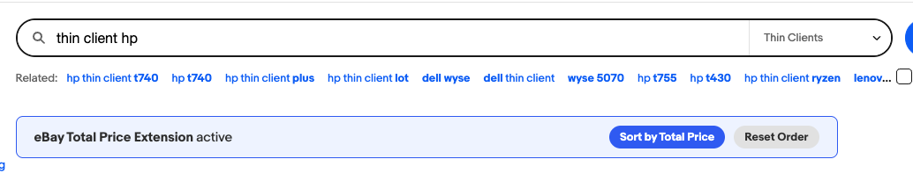
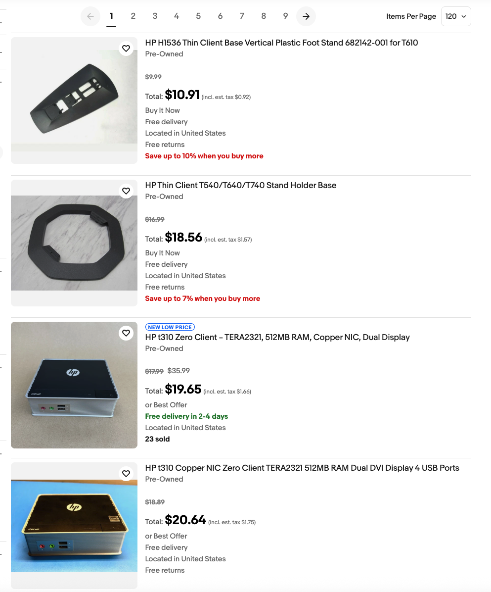

# eBay Total Price Chrome Extension

A powerful browser extension that enhances your eBay shopping experience by calculating and displaying the **Total Price** (Base Price + Estimated Tax + Shipping) directly on search results and item cards.

## 🚀 Key Features

- **Total Price Calculation**: Automatically sums up the item price, estimated sales tax, and shipping costs.
- **Smart Parsing**: Intelligently extracts shipping costs even when they are buried in attribute rows.
- **Dynamic Sorting**: Sort your search results by the actual **Total Price** with a single click.
- **Customizable Settings**:
    - Set your local ZIP code (Default: 95050 - Santa Clara, CA).
    - Adjust the estimated sales tax rate (Default: 9.25%).
    - Toggle "Grey out original price" to focus on the total cost.
- **In-Page Banner**: Convenient controls injected directly above eBay search results for quick access to sorting.

## 🛠️ Installation

This extension is currently in development and can be installed via **Developer Mode**:

1. Dowload or clone this repository to your local machine.
2. Open Google Chrome and navigate to `chrome://extensions/`.
3. Enable **Developer mode** using the toggle in the top-right corner.
4. Click **Load unpacked** and select the root directory of this project (`ebay-ext`).
5. Pin the extension for quick access to settings!

## ⚙️ Configuration

To customize the extension:
1. Click the extension icon in your toolbar.
2. Select **Options** (or use the popup if available) to open the settings page.
3. Enter your **ZIP Code** and **Tax Rate**.
4. Click **Save Settings** to apply changes.

## 🖥️ How it Works

The extension uses a `MutationObserver` to watch for changes in the eBay search results page. When new items are loaded (e.g., via "Load More" or infinite scroll), it:
1. Parses the base price.
2. Identifies shipping costs from various eBay UI elements.
3. Calculates the estimated tax based on your configured rate.
4. Injects a clear "Total" price label and value near the original price.

---

*Happy Shopping!*
